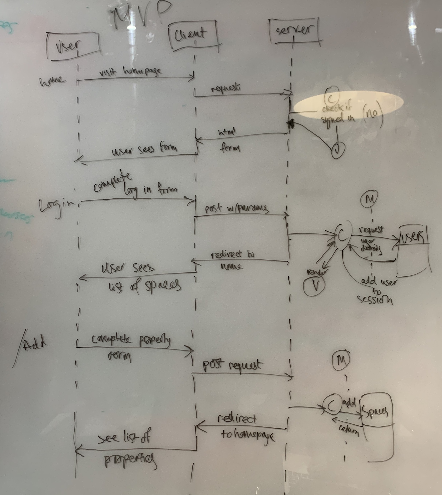
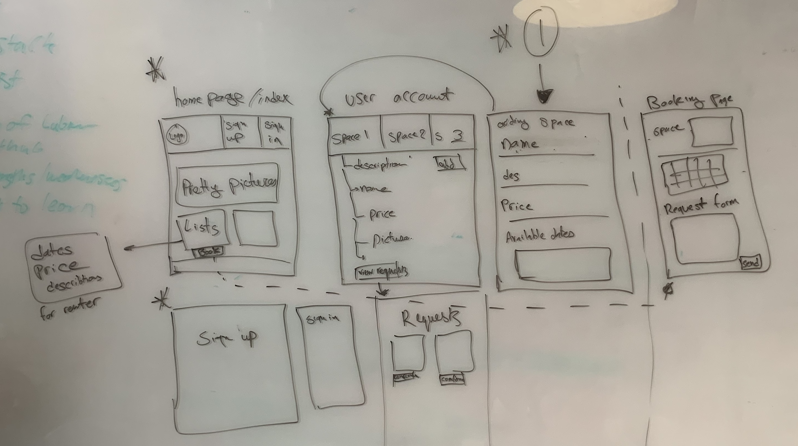

### [Makers Academy](http://www.makersacademy.com) - Week 6 Team programming challenge 

# MakersBnB 🏠

#### Technologies: Javascript, Jasmine, Ruby, Rspec, Capybara, Sinatra, ActiveRecord, HTML, CSS, RuboCop, ESLint

A web application that allows users to list spaces they have available, and to hire spaces for the night.

### Headline specifications

* Any signed-up user can list a new space.
* Users can list multiple spaces.
* Users should be able to name their space, provide a short description of the space, and a price per night.
* Users should be able to offer a range of dates where their space is available.
* Any signed-up user can request to hire any space for one night, and this should be approved by the user that owns that space.
* Nights for which a space has already been booked should not be available for users to book that space.
* Until a user has confirmed a booking request, that space can still be booked for that night.

### User Stories

#### MVP

```
As a user,
So I can list my space,
I would like to be able to sign up
```
```
As a user,
So I can manage my spaces,
I would like to be able to sign in
```
```
As a user,
So I can rent my property,
I would like to list a space
```

#### More features

```
As a user,
So I can manage my property,
I would like to be able to add a name, price and description
```
```
As a user,
So I can manage my properties,
I would like to be able to list multiple spaces   
```
```
As a user,
To show my space is available,
I would like to be able to specify a range of dates
```
```
As a renter,
To rent a space,
I would like to be able to see a list of spaces
```
```
As a renter,
To rent a space,
I would like to see a space's available dates
```
```
As a renter,
To rent a space,
I would like to request to book a space
```
```
As a user,
To manage my spaces,
I would like to view booking requests
```
```
As a user,
To confirm a rental,
I would like to approve a booking
```
```
As a user,
To prevent double-bookings,
I would like a space to be unavailable during booked dates 
```

### Domain model



### Mockup



### Contributors

[Elena Beccaro](https://github.com/elebecca)
[Liz Daly](https://github.com/lookupdaily)
[Barri Faryad](https://github.com/BarriF13)
[Ellie Jones](https://github.com/EllieRichardsonJones)
[David McGregor](https://github.com/davmcgregor)